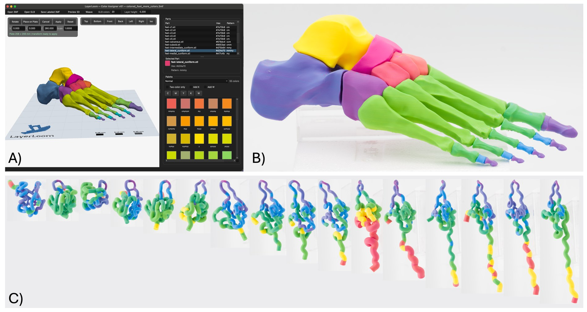

# LayerLoom

LayerLoom is an experimental Python toolkit for expanding the apparent color
palette of multi-material FFF prints. It imports 3MF/GLB models, assigns
palette colors, and generates woven multi-material 3MF files where color is
encoded as repeated layer schedules rather than as one direct filament per
visible color.

The goal is practical: produce more apparent colors from ordinary loaded
filaments without custom color-mixing hardware, custom filament fabrication, or
a weaving-aware slicer.

The current public entrypoint is the Qt GUI from the v65 line, which includes
vendor 3MF normalization, streaming preview support for large models,
whole-model build-plate move/rotate controls, and expanded `N`/`O`/`V`/`G`
palette controls for gray, orange, violet, and green.



*LayerLoom application examples: GUI assignment, printed multi-material color,
and scientific visualization workflows.*

## Status

LayerLoom is alpha research software. It is useful, but the public API is not
stable yet. Expect file-format edge cases and slicer-specific quirks.

LayerLoom outputs are standard 3MF files intended for ordinary slicer workflows,
but they are not full project round-trips for vendor-specific slicer files.

## Quick Start From GitHub

Use Python 3.10, 3.11, or 3.12. A virtual environment is strongly recommended
so LayerLoom does not accidentally use a Python from another app or tool.

For a packaged release, install the GUI extras:

```bash
python -m pip install "layerloom[gui]"
layerloom-doctor
layerloom-gui
```

For development or the newest source checkout, clone from GitHub:

macOS and Linux:

```bash
git clone https://github.com/Finn2400/layerloom.git
cd layerloom
python3 -m venv .venv
source .venv/bin/activate
python -m pip install --upgrade pip
python -m pip install -e ".[gui]"
layerloom-doctor
layerloom-gui
```

On macOS, a source checkout also includes a double-click launcher:

```text
Launch LayerLoom.command
```

Double-clicking it creates or reuses `.venv`, installs the GUI dependencies if
needed, runs `layerloom-doctor`, and opens the GUI. The terminal commands above
remain the most explicit/reproducible install path. If a ZIP download loses the
launcher permission, run `chmod +x "Launch LayerLoom.command"` once.

On Windows, double-click:

```text
Launch LayerLoom.bat
```

The Windows launcher follows the same path: create or reuse `.venv`, install
the GUI dependencies if needed, run `layerloom-doctor`, and open the GUI. It
uses the Windows `py` launcher when available, then falls back to `python`.

Windows PowerShell:

```powershell
git clone https://github.com/Finn2400/layerloom.git
cd layerloom
py -3.12 -m venv .venv
.\.venv\Scripts\Activate.ps1
python -m pip install --upgrade pip
python -m pip install -e ".[gui]"
layerloom-doctor
layerloom-gui
```

If PowerShell blocks virtual-environment activation, see
[docs/install.md](docs/install.md).

For development, analysis, and benchmark plotting tools:

```bash
python -m pip install -e ".[gui,bench,analysis,dev]"
```

## Run The GUI

On macOS, double-click:

```text
Launch LayerLoom.command
```

On Windows, double-click:

```text
Launch LayerLoom.bat
```

Or run the installed command:

```bash
layerloom-gui
```

From a source checkout you can also run:

```bash
python src/layerloom/3mf_gui_v65.py
```

If the GUI does not open, run:

```bash
layerloom-doctor
```

The doctor command checks your Python environment, core dependencies, GUI
dependencies, and tutorial example files.

## Beginner Tutorial And Examples

Start with the walkthrough in [docs/tutorial.md](docs/tutorial.md). It includes
a first-run checklist and uses two CMY sample inputs in [examples/](examples/):

- [examples/tutorial_cmy_cubes.3mf](examples/tutorial_cmy_cubes.3mf): a basic
  cyan/magenta/yellow cube example with pre-tagged weave patterns.
- [examples/tutorial_cmy_benchy_cutup.3mf](examples/tutorial_cmy_benchy_cutup.3mf):
  a pre-labeled cut-up 3DBenchy example using only cyan, magenta, and yellow
  tokens.

These files are intentionally simple so new users can learn the open, weave,
slice, and filament-assignment workflow before trying larger models.
The GUI also includes a **Load Example** button that opens the packaged CMY
Benchy example directly.

## Palette Options

The default `Normal` palette uses LayerLoom's nominal model-generated colors.
The optional `Calibrated CMY Normal (core065)` palette uses measured printed
CMY colors from the core065 gamut analysis where available, falling back to
nominal colors for unmeasured recipes. When this palette is active, GLB/3MF
source colors are matched against the measured printed colors, so imported
colors choose the recipe expected to print closest rather than the recipe whose
nominal screen color is closest.

## Command Line Tools

Check whether the install is ready for the tutorial/GUI path:

```bash
layerloom-doctor
```

Normalize a 3MF into LayerLoom's generic internal 3MF form:

```bash
layerloom-normalize input.3mf --output normalized.3mf
```

Generate a woven 3MF:

```bash
layerloom-weave --input input.3mf --step 0.08 --output output_woven.3mf
```

Run the headless GLB-to-woven workflow, intended for colored GLB/GLTF exports
from tools such as ChimeraX:

```bash
pip install "layerloom[headless]"
layerloom-headless protein.glb
layerloom-headless protein.glb --output ~/Downloads/protein_woven.3mf --orientation-quality thorough
```

By default, `layerloom-headless` imports up to about 20 GLB color groups, matches
them to the `Normal` palette, safely attempts mesh repair, searches for a
support-saving orientation, fits the footprint into a 180 x 180 mm box, weaves at
0.08 mm, and writes the final woven 3MF to `~/Downloads`.

Generate benchmark geometry:

```bash
layerloom-simplified-speed-suite --help
layerloom-benchmark-suite --help
```

## How LayerLoom Works

LayerLoom shifts color planning into geometry:

1. Normalize the input model into a generic internal 3MF.
2. Preserve best-effort display names, source color metadata, and weave tokens.
3. Assign each editable part a weave signature such as `cy`, `yyyc`, or `cym`.
4. Slice selected geometry into horizontal Z-bands at the chosen weave height.
5. Regroup bands into per-filament output objects such as `all_cyan`,
   `all_magenta`, and `all_yellow`.
6. Open the resulting 3MF in a standard slicer and assign those objects to the
   physical filaments loaded in the printer.

LayerLoom normalizes incoming 3MFs before editing:

- resolves build items, components, transforms, and production-extension child models
- flattens reachable geometry into editable mesh parts
- preserves best-effort display names and color/pattern metadata
- writes LayerLoom-style generic 3MF outputs rather than preserving full slicer project semantics

## Slicer Compatibility

LayerLoom 3MF outputs have been opened and sliced successfully in:

- OrcaSlicer
- Bambu Studio
- PrusaSlicer
- Ultimaker Cura 5.12.0

For Cura, disable automatic object drop-to-plate behavior before opening woven
LayerLoom outputs. Otherwise Cura may reinterpret the intentional vertical
banding/placement in a way that breaks the woven geometry.

More setup notes are in
[docs/slicer_compatibility.md](docs/slicer_compatibility.md). Install and
platform troubleshooting is in [docs/install.md](docs/install.md).

## Layer Height Rules

Use the same slicer layer height as the LayerLoom weave height. The first layer
height should be an integer multiple of the weave height so slicer layers stay
aligned to woven Z-bands.

Examples:

| Weave height | Valid first layer examples | Avoid |
| --- | --- | --- |
| `0.08 mm` | `0.08 mm`, `0.16 mm`, `0.24 mm` | `0.20 mm` |
| `0.12 mm` | `0.12 mm`, `0.24 mm` | `0.20 mm` |
| `0.16 mm` | `0.16 mm`, `0.32 mm` | `0.20 mm`, `0.24 mm` |
| `0.20 mm` | `0.20 mm`, `0.40 mm` | `0.24 mm` |

For example, if the weave height is `0.08 mm`, a `0.16 mm` first layer is fine,
but `0.20 mm` is not because it cuts through the weave schedule at a half-step.

## Practical Caveats

- LayerLoom produces apparent woven colors, not full-color material mixing.
- The calibrated CMY palette improves display and matching for measured CMY
  recipes, but it is still specific to the measured printer/material/lighting
  workflow behind the core065 analysis.
- Broad flat top and bottom surfaces reveal layer striation more strongly than
  steep or vertical surfaces.
- High-contrast filament combinations show woven layers more readily than
  lower-contrast combinations.
- Changing the target weave pattern requires regenerating geometry.
- Vendor-specific 3MF features such as slicer modifiers, textures, and project
  settings are not guaranteed to survive normalization.
- Thin features near weave-band boundaries may need inspection after weaving.

## Repository Layout

```text
src/layerloom/
  3mf_gui_v65.py              # current GUI implementation
  gui_app.py                  # stable GUI command wrapper
  cli.py                      # stable CLI wrappers
  normalize_3mf_import.py     # canonical 3MF import normalizer
  weave.py                    # woven 3MF generation pipeline
  palettes/                   # packaged palette JSON files
  examples/                   # packaged tutorial 3MF files used by Load Example
  legacy/                     # older/experimental code
examples/
  tutorial_cmy_cubes.3mf      # beginner CMY sample input
  tutorial_cmy_benchy_cutup.3mf
tests/
  test_smoke.py               # lightweight import/package checks
```

## Large Files

Generated 3MF/STL/GLB files are intentionally ignored by git. The tiny tutorial
fixtures in [examples/](examples/) are the exception. Keep large test models,
slicer exports, and generated benchmark outputs outside the tracked repo or
publish them separately as release assets or Zenodo datasets.

Raw photographs, calibrated TIFF exports, manuscript figure workspaces, and
one-off analysis outputs are also intentionally kept out of the public software
repo. See [docs/release_and_zenodo.md](docs/release_and_zenodo.md) for the
release checklist and archival DOI workflow.

## Citation And DOI

Citation metadata is provided in [CITATION.cff](CITATION.cff). A persistent DOI
should be minted from a tagged GitHub release through Zenodo before manuscript
submission. After Zenodo creates the DOI, add the DOI badge and citation record
here.

## License

MIT. See `LICENSE`.
