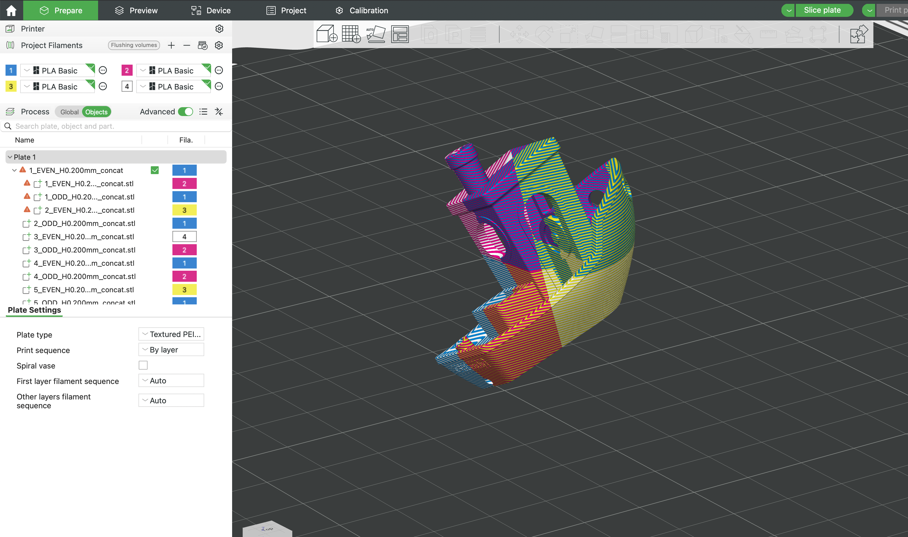

> Weave your 3D prints into color.  
> Split a 3MF into repeating layer bands (EVEN/ODD or more), ready for multi-color / multi-material prints.

---

## What it does

Layer Loom takes a standard `.3mf` and groups its Z-bands into **K repeating sets** (default **2 = EVEN/ODD**). You get per-group meshes with slicer-friendly names like `part_001_EVEN` and `part_001_ODD`.

- 🔁 **Band into K groups**: default 2 (EVEN/ODD); use `--groups N` for more  
- 🧭 **Smart Z0**: `auto-global`, `auto-local`, or `fixed` origins  
- 🧱 **Optional scene meshes**: whole-model composites for each group  
- 🏷️ **Readable part names** in Bambu Studio / PrusaSlicer / OrcaSlicer  
- 🔧 **Automatic “bake”** if your 3MF uses transforms/components

---

## Install

```bash
# from source
python3 -m pip install -e .
````

**Requires:** Python 3.9+, `trimesh`, `numpy`, `lxml`.

---

## Quick start

```bash
layerloom \
  -i samples/benchy_cutup.3mf \
  -o benchy_grouped.3mf \
  -H 0.20 \
  --z0-mode auto-global \
  --groups 2 \
  -v
```

Open `benchy_grouped.3mf` in your slicer to preview the alternating bands.

<div align="center">
  
</div>

---

## CLI

```
usage: layerloom [-h] -i INPUT -o OUTPUT -H LAYER_HEIGHT_MM
                 [--z0-mode {auto-global,auto-local,fixed}]
                 [--z0-mm Z0_MM] [--groups GROUPS]
                 [--include-scene] [-v]
```

| Flag                    | Type  | Default     | Description                          |
| ----------------------- | ----- | ----------- | ------------------------------------ |
| `-i, --input`           | path  | —           | Input 3MF                            |
| `-o, --output`          | path  | —           | Output 3MF                           |
| `-H, --layer-height-mm` | float | —           | Band height in mm                    |
| `--z0-mode`             | enum  | auto-global | `auto-global`, `auto-local`, `fixed` |
| `--z0-mm`               | float | —           | Z0 if `--z0-mode fixed`              |
| `--groups`              | int   | 2           | Number of repeating groups           |
| `--include-scene`       | flag  | off         | Add scene-level grouped meshes       |
| `-v, --verbose`         | flag  | off         | Extra logging                        |

### Z0 modes

* **auto-global**: all parts share the same Z0 = scene min Z (most predictable for multi-part scenes)
* **auto-local**: each part uses its own min Z as Z0 (good when parts are offset in Z)
* **fixed**: use a specific Z0 via `--z0-mm`

---

## Known limits

* Boolean slicing can be slow on extremely dense meshes; keep `-H` realistic for your print.
* Names appear in most slicers, but some vendor metadata fields may be ignored.

---

## Dev utilities

Extra debugging scripts live in `scripts/dev/` (not installed with the CLI). See `scripts/dev/README.md`.

---

## License

MIT © Finn Beruldsen


